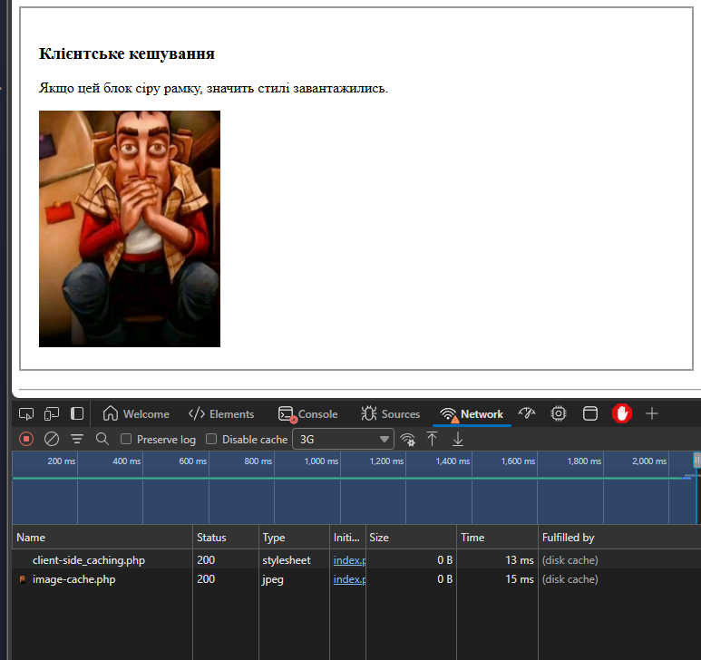
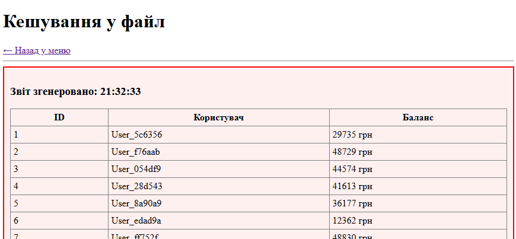
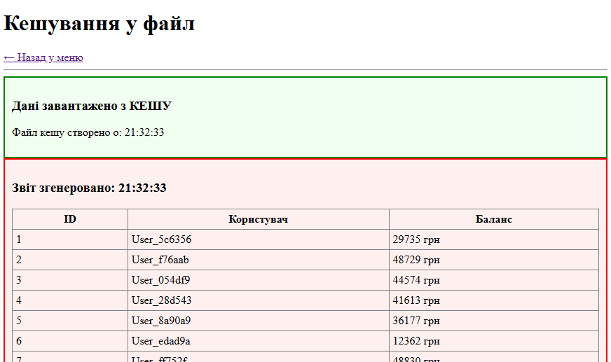
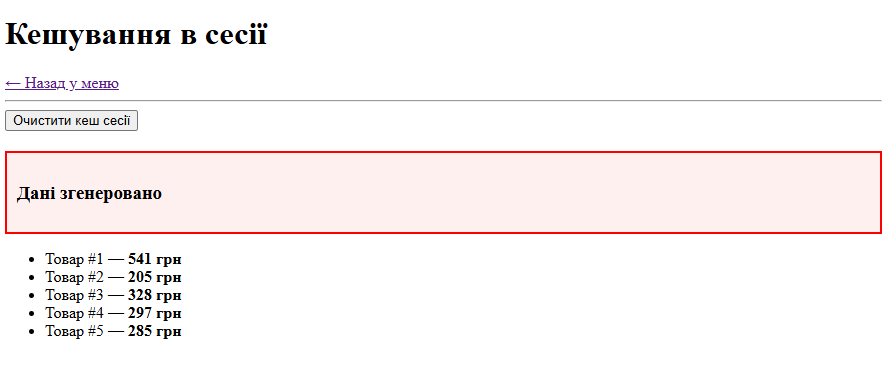
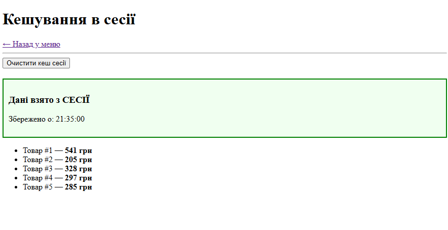

**Лабораторна робота № 7 \
Тема:  Робота з кешем в Web на PHP**  
======================================

## Завдання 1. Клієнтське кешування (HTTP Headers)

**Опис реалізації:**
Ми створили скрипти для віддачі CSS-стилів (`client-side_caching.php`) та зображень (`image-cache.php`). У цих файлах за допомогою функції `header()` були додані заголовки:
* `Cache-Control: public, max-age=...` — вказує браузеру зберігати файл у себе.
* `Expires` — вказує точну дату, до якої файл вважається актуальним.

**Результат:**
При повторному завантаженні сторінки браузер не скачує файли з сервера, а бере їх зі свого кешу (`disk cache`), що видно у вкладці Network.

---

## Завдання 2. Серверне кешування (Файл)

**Опис реалізації:**
Створено скрипт `file-caching.php`, який імітує складну генерацію `report` (затримка 3 секунди).
* При першому запиті скрипт генерує HTML-таблицю і зберігає її у файл `cache/report.html`.
* При наступних запитах скрипт перевіряє вік файлу (`filemtime`). Якщо файл свіжий (менше 10 хвилин), скрипт просто читає його вміст, оминаючи затримку.

**Демонстрація:**

1. **Перший запуск** (генерація, червона рамка):

2. **Повторний запуск** (читання з файлу, зелена рамка):

---

## Завдання 3. Серверне кешування (Сесія)

**Опис реалізації:**
Створено скрипт `session-caching.php`. Принцип схожий на попередній, але дані зберігаються не у файлі на диску, а в оперативній пам'яті сервера (у сесії користувача `$_SESSION`).
* Це дозволяє кешувати персональні дані конкретного користувача.
* Реалізовано кнопку очищення сесії для перевірки роботи механізму.

**Демонстрація:**

1. **Перший запуск** (обчислення даних):

2. **Повторний запуск** (дані беруться із сесії):

---

## Висновок
У ході лабораторної роботи ми реалізували три типи кешування:
1.  **Клієнтське** — зменшує трафік та навантаження на мережу.
2.  **Серверне (файлове)** — дозволяє зберігати загальні дані для всіх користувачів, знижуючи навантаження на процесор.
3.  **Серверне (сесійне)** — дозволяє швидко віддавати персональні дані конкретного користувача.
